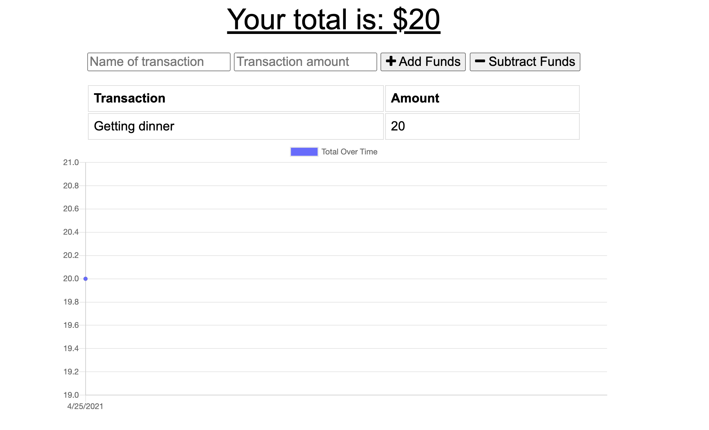

# Budget Tracker

Giving users a fast and easy way to track their money is important, but allowing them to access that information at any time is even more important. Having offline functionality is paramount to the success of an application that handles users’ financial information.

This challenge required us to update an existing budget tracker application to allow for offline access and functionality.



## User Story

```md
AS AN avid traveler
I WANT to be able to track my withdrawals and deposits with or without a data/internet connection
SO THAT my account balance is accurate when I am traveling
```

## Acceptance Criteria

```md
GIVEN a budget tracker without an internet connection
WHEN the user inputs an expense or deposit
THEN they will receive a notification that they have added an expense or deposit
WHEN the user reestablishes an internet connection
THEN the deposits or expenses added while they were offline are added to their transaction history and their totals are updated
```

## Deployed Application

[Heroku](https://frozen-bastion-70522.herokuapp.com/)

## Questions

If you have any other questions or concerns, please reach out via email aliciamvega94@gmail.com or via <a href="https://github.com/aliciavega731"> Github</a>.